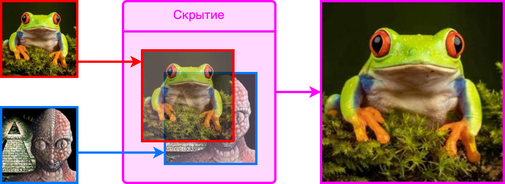
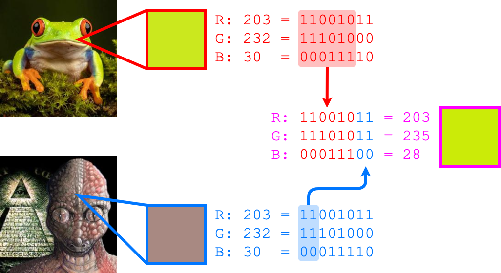
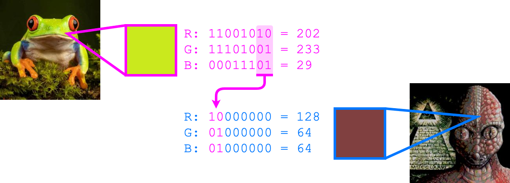

<h1><div align="right">
<a href="README.md">🇺🇸</a>
<code>🇷🇺</code> 
</div>
Стеганография
</h1>

Стеганография - это способ передачи или хранения информации с учетом сохранения в тайне самого факта такой передачи (хранения).

В этом репозитории представлен простой способ прятать какое-либо секретное изображение внутри другого изображения:



Как можно видеть, результат (который справа) почти не отличается от исходного изображения. Однако внутри него зашифровано секретное изображение, которое можно легко извлечь:


<details>
<summary>&nbsp;Как это работает?</summary>
<blockquote></blockquote>
<blockquote>
Идея состоит в том, чтобы N старших бит секретного изображения вставить на место N младших бит исходного. Сделать это необходимо для каждого из трех каналов (R, G, B) каждого пикселя. Например, если N = 2:
<blockquote></blockquote>



Получившийся цвет почти не отличается от цвета исходного изображения, потому что разницу в младших битах сложно определить на глаз. Чтобы затем извлечь секретное изображение обратно, необходимо просто сместить N младших бит на место старших:



Очевидно, что секретное изображение стало менее качественным после извлечения, ведь оно осталось без (8 - N) младших бит! Поэтому важно понимать, что чем больше бит выделяется под секретное изображение, тем лучше оно сохранит качество, но при этом будет более заметно в исходном изображении на глаз.
</blockquote>
</details>

## Использование

1. В первую очередь необходимо скачать файл [`utils.py`](utils.py), в котором определены все функции, чтобы прятать и извлекать изображения.

2. Затем необходимо установить следующие библиотеки:
```bash
pip install numpy==1.26.3
pip install pillow==10.2.0
```

3. Наконец, можно пользоваться:
```Python
from utils import hide, unhide

hide(source_img='source.jpg', # путь к исходному изображению
     secret_img='secret.jpg', # путь к изображению, которое нужно спрятать
     save_as='result.png',    # путь, куда нужно сохранить результат
     visibility=2):           # сколько бит выделить для секретного изображения

unhide(image='result.png',      # путь к изображению с секретом
       save_as='extracted.jpg', # путь, куда сохранить извлеченное изображение
       visibility=2):           # сколько бит было выделено для секретного изображения
```

> Отдельно стоит отметить, что для сохранения изображений с секретом важно использовать расширения, которые либо слабо сжимают изображение, либо не сжимают его вообще. Иначе спрятанное изображение потом невозможно будет извлечь!<br>
:green_circle: Рекомендуемые расширения: <kbd>.png</kbd>, <kbd>.bmp</kbd>, <kbd>.tiff</kbd>, <kbd>.tif</kbd>.<br>
:red_circle: Категорически не рекомендуются: <kbd>.jpg</kbd>, <kbd>.jpeg</kbd>, <kbd>.gif</kbd>, <kbd>.webp</kbd>, <kbd>.ico</kbd>.