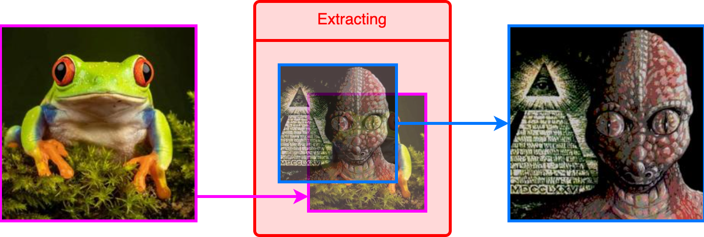

<h1><div align="right">
<code>🇺🇸</code> 
<a href="README-RU.md">🇷🇺</a>
</div>
Steganography
</h1>

Steganography is the practice of representing information within another message or physical object, in such a manner that the presence of the information is not evident to human inspection.

This repository presents a simple way to hide a secret image inside another image:


As you can see, the result (the image on the right) is almost identical to the original image. However, there is a secret image encrypted inside that can be extracted:



<details>
<summary>&nbsp;How does it work?</summary>
<blockquote></blockquote>
<blockquote>
sd
</blockquote>
</details>

## Using

1. Download file [`utils.py`](utils.py). This is all you need for steganography.

2. Install required libraries:
```bash
pip install numpy==1.26.3
pip install pillow==10.2.0
```


3. Simple example of using:
```Python
from utils import hide, unhide

hide()
```