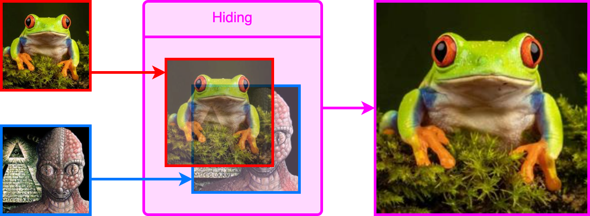

<h1><div align="right">
<code>🇺🇸</code> 
<a href="README-RU.md">🇷🇺</a>
</div>
Steganography
</h1>

Steganography is the practice of representing information within another message or physical object, in such a manner that the presence of the information is not evident to human inspection.

This repository presents a simple way to hide a secret image inside another image:



As you can see, the result (the image on the right) is almost identical to the source image. However, there is a secret image encrypted inside that can be extracted:


<details>
<summary>&nbsp;How does it work?</summary>
<blockquote></blockquote>
<blockquote>
The essence of the method is to take N high bits of each pixel in each of the three channels (R, G, B) of the secret image and insert them in place of N low bits of the source image. For example, if N = 2:
<blockquote></blockquote>


The color of the source image is almost unchanged because the difference in the low bits is hard to distinguish by eye. To then extract the secret from such an image, it is necessary to shift N low bits to the place of the high bits:


Obviously, the secret image became lower quality after extraction. The more bits are allocated to it, the more quality it will retain, but also the more likely it will be detected by eye in the source image.
</blockquote>
</details>

## Using

1. Download [`utils.py`](utils.py) file. 

2. Install required libraries:
```bash
pip install numpy==1.26.3
pip install pillow==10.2.0
```

3. Use it:
```Python
from utils import hide, extract

hide(source_img='source.jpg', # path to source image
     secret_img='secret.jpg', # path to image you want to hide
     save_as='result.png',    # path to save the result
     visibility=2)            # number of bits for secret image

extract(image='result.png',      # path to image with secret
        save_as='extracted.jpg', # path to save extracted image
        visibility=2)            # number of bits for secret image
```

> Note that for saving images with hidden secret it is better to use extensions that compress images little or not at all. Otherwise the hidden image will be impossible to extract! <br>
$\color{Green}\large{\bullet}$ Recommended extensions: <kbd>.png</kbd>, <kbd>.bmp</kbd>, <kbd>.tiff</kbd>, <kbd>.tif</kbd>.<br>
$\color{Red}\large{\bullet}$ Сategorically not recommended: <kbd>.jpg</kbd>, <kbd>.jpeg</kbd>, <kbd>.gif</kbd>, <kbd>.webp</kbd>, <kbd>.ico</kbd>.